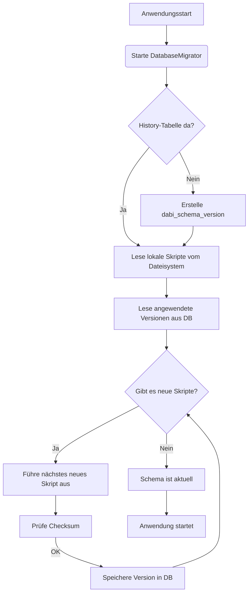
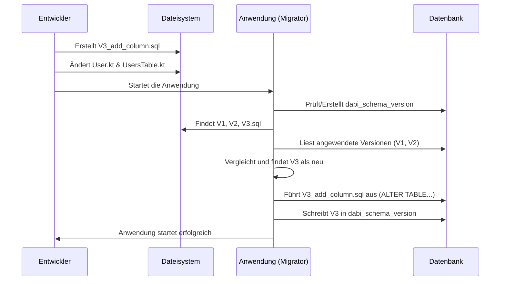

# Anleitung: Datenbank-Migration im DaBi-Framework

Dieses Dokument beschreibt, wie das integrierte, skriptbasierte Datenbanksystem funktioniert und wie Sie es verwenden, um Änderungen an Ihrem Datenbankschema sicher und versioniert zu verwalten.

## 1. Einführung

Wenn Sie im Team arbeiten oder eine Anwendung in verschiedenen Umgebungen (Entwicklung, Test, Produktion) betreiben, ist es entscheidend, dass die Struktur der Datenbank immer mit dem Code übereinstimmt. Das Migrationssystem automatisiert diesen Prozess.

Es sorgt dafür, dass Änderungen am Datenbankschema (wie das Hinzufügen einer Tabelle oder das Ändern einer Spalte) in einer kontrollierten, wiederholbaren und nachvollziehbaren Weise auf jede Datenbank angewendet werden.

## 2. Kernkonzepte

### Migrations-Skripte

Eine Migration ist ein einfaches SQL-Skript, das eine bestimmte Änderung an der Datenbank vornimmt. Alle Skripte werden in einem festen Verzeichnis abgelegt:
`src/main/resources/db/migration`

### Namenskonvention

Damit die Skripte in der richtigen Reihenfolge ausgeführt werden, müssen sie einer strikten Namenskonvention folgen:

`V<Version>__<Beschreibung>.sql`

- **`V`**: Einem literalen 'V'.
- **`<Version>`**: Eine Ganzzahl (1, 2, 3, ...), die mit jeder neuen Migration erhöht wird. **Die Reihenfolge ist entscheidend!**
- **`__`**: Zwei Unterstriche trennen die Version von der Beschreibung.
- **`<Beschreibung>`**: Ein kurzer, lesbarer Text, der die Änderung beschreibt (Wörter werden mit Unterstrichen getrennt).
- **`.sql`**: Die Dateiendung.

**Beispiele:**
- `V1__Initial_schema.sql`
- `V2__Add_phone_number_to_users.sql`
- `V3__Create_products_table.sql`

### Die `dabi_schema_version`-Tabelle

Dies ist das "Gehirn" des Migrationssystems. Der `DatabaseMigrator` erstellt und verwaltet diese Tabelle automatisch in Ihrer Datenbank. Sie enthält eine Aufzeichnung aller bereits ausgeführten Migrationen.

| Spalte | Beschreibung |
|---|---|
| `version` | Die Versionsnummer des Skripts. |
| `script_name` | Der beschreibende Name des Skripts. |
| `checksum` | Ein SHA-256 Hash des Skript-Inhalts zum Zeitpunkt der Ausführung. |
| `applied_at` | Der Zeitstempel, wann das Skript angewendet wurde. |

## 3. Workflow: Eine neue Migration erstellen (Schritt für Schritt)

Angenommen, wir möchten eine neue Spalte `is_premium` (vom Typ Boolean) zur `users`-Tabelle hinzufügen.

### Schritt 1: Das SQL-Skript erstellen

Erstellen Sie eine neue Datei im Verzeichnis `src/main/resources/db/migration/`. Da unsere letzte Version `V2` war, ist die neue Version `V3`.

**Dateiname:** `V3__Add_is_premium_to_users.sql`

**Inhalt:**
```sql
ALTER TABLE users ADD COLUMN is_premium BOOLEAN DEFAULT FALSE NOT NULL;
```

### Schritt 2: Den Kotlin-Code anpassen

Damit Ihr Code von der neuen Spalte weiß, müssen die `Entity`-Klasse und das `Table`-Objekt aktualisiert werden.

**Datei:** `src/main/kotlin/dbdata/Main.kt`

1.  **`UsersTable`-Objekt erweitern:**
    ```kotlin
    object UsersTable : Table("users") {
        // ... bestehende Spalten
        val updatedBy = long("updated_by").nullable()
        val phoneNumber = varchar("phone_number", 255).nullable()
        val isPremium = bool("is_premium").default(false) // <-- NEU

        override val primaryKey = PrimaryKey(id)
    }
    ```

2.  **`User`-Klasse erweitern:**
    ```kotlin
    class User(
        // ... bestehende Eigenschaften
        override var updatedBy: Long? = null,
        val phoneNumber: String? = null,
        val isPremium: Boolean = false // <-- NEU
    ) : Entity<Long> {
        // ...
    }
    ```

### Schritt 3: Die Anwendung ausführen

Das ist alles! Wenn Sie Ihre Anwendung das nächste Mal starten, passiert Folgendes automatisch:
1.  Der `DatabaseMigrator` scannt das Migrationsverzeichnis.
2.  Er vergleicht die gefundenen Skripte (`V1`, `V2`, `V3`) mit den Einträgen in der `dabi_schema_version`-Tabelle (die bisher nur `V1` und `V2` enthält).
3.  Er erkennt, dass `V3` neu ist.
4.  Er führt den Inhalt von `V3__Add_is_premium_to_users.sql` aus.
5.  Nach erfolgreicher Ausführung fügt er einen neuen Eintrag für Version `3` in die `dabi_schema_version`-Tabelle ein.
6.  Die Anwendung startet normal mit dem aktualisierten Datenbankschema und Code.

## 4. Visualisierung des Prozesses

### Ablauf des Migrators



### Entwickler-Workflow



## 5. Wichtiges Sicherheitsmerkmal: Checksum-Validierung

Jedes Mal, wenn der Migrator läuft, vergleicht er den Checksum (Hash-Wert) der lokalen Skript-Dateien mit den Checksums, die in der `dabi_schema_version`-Tabelle gespeichert sind.

**Was passiert, wenn ein bereits angewendetes Skript geändert wird?**

Der Migrator wird einen **Fehler** auslösen und die Anwendung anhalten!

**Warum ist das wichtig?**
Dies ist ein entscheidendes Sicherheitsnetz. Es verhindert, dass jemand versehentlich oder absichtlich eine bereits durchgeführte Migration ändert. Solche Änderungen könnten in verschiedenen Umgebungen zu inkonsistenten Datenbankzuständen führen und sind eine häufige Fehlerquelle.

**Regel:** Eine einmal angewendete Migration darf **niemals** geändert werden. Wenn Sie einen Fehler korrigieren oder eine weitere Änderung vornehmen müssen, erstellen Sie eine **neue** Migration (z.B. `V4__Fix_premium_user_default.sql`).
